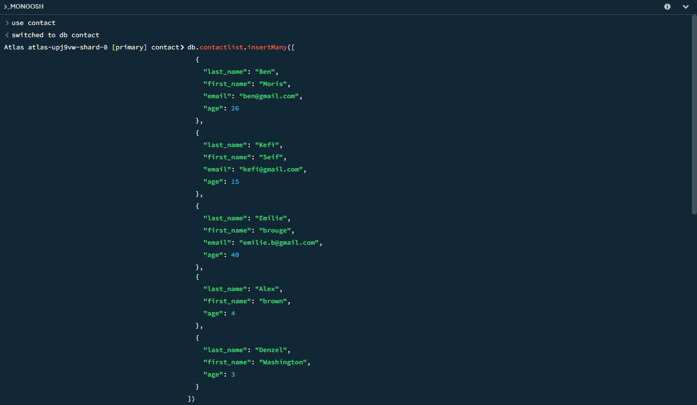
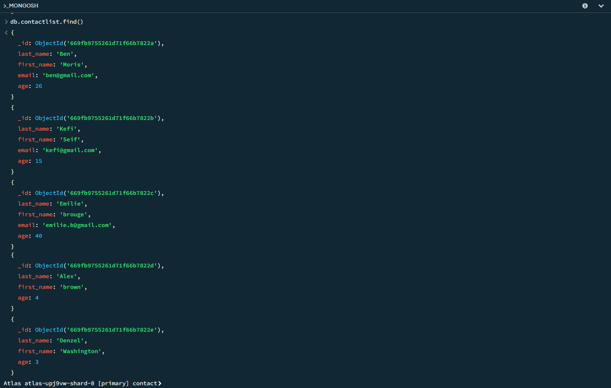
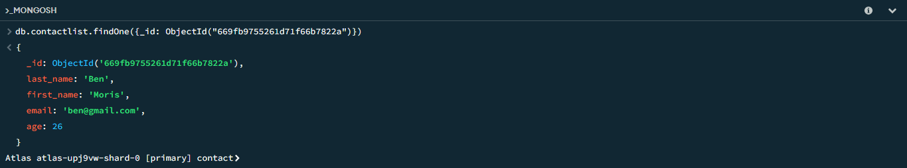
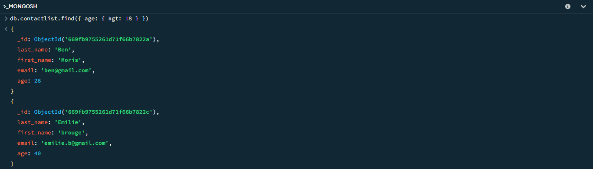
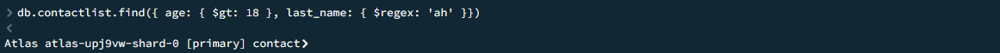
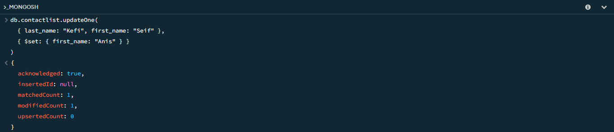
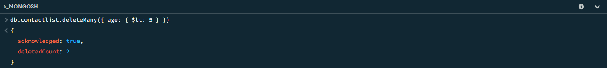
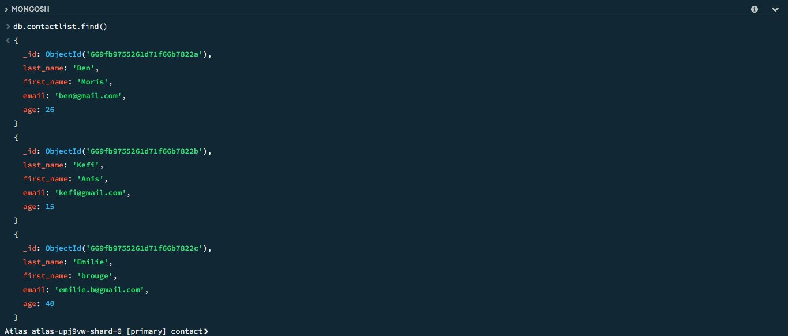

# Checkpoint MongoDB

### Instructions

1. Créer une base de données appelée « contact ».
2. Créer une collection appelée « contactlist ».
3. Insérer ces documents dans la "contactlist" :
    - Nom : Ben, Prénom : Moris, Email : ben@gmail.com, âge : 26 ans
    - Nom : Kefi, Prénom : Seif, Email : kefi@gmail.com, âge : 15 ans
    - Nom : Emilie, Prénom : brouge, Email : emilie.b@gmail.com, âge : 40 ans
    - Nom : Alex, Prénom : brown, âge : 4 ans
    - Nom : Denzel, Prénom : Washington, âge : 3 ans
4. Afficher toute la liste des contacts.
5. Afficher toutes les informations concernant une seule personne en utilisant son identifiant.
6. Afficher tous les contacts avec un âge >18.
7. Afficher tous les contacts avec un âge>18 et un nom contenant "ah".
8. Modifiez le prénom du contact de « Kefi Seif » à « Kefi Anis ».
9. Supprimez les contacts âgés de moins de 5 ans.
10. Afficher toute la liste des contacts.
**NB : Vous devez enregistrer votre travail sous forme de captures d'écran.**

### Opérations que j'ai réalisé

1. **Insérer les documents dans la "contactlist"**  
   Code MongoDB :
   ```jsx
   db.contactlist.insertMany([
     {
       "last_name": "Ben",
       "first_name": "Moris",
       "email": "ben@gmail.com",
       "age": 26
     },
     {
       "last_name": "Kefi",
       "first_name": "Seif",
       "email": "kefi@gmail.com",
       "age": 15
     },
     {
       "last_name": "Emilie",
       "first_name": "brouge",
       "email": "emilie.b@gmail.com",
       "age": 40
     },
     {
       "last_name": "Alex",
       "first_name": "brown",
       "age": 4
     },
     {
       "last_name": "Denzel",
       "first_name": "Washington",
       "age": 3
     }
   ])
   ```
   

2. **Afficher toute la liste des contacts**  
   Code MongoDB :
   ```jsx
   db.contactlist.find()
   ```
   

3. **Afficher toutes les informations concernant une seule personne en utilisant son identifiant**  
   Code MongoDB :
   ```jsx
   db.contactlist.findOne({_id: ObjectId("669fb9755261d71f66b7822a")})
   ```
   

4. **Afficher tous les contacts avec un âge >18**  
   Code MongoDB :
   ```jsx
   db.contactlist.find({ age: { $gt: 18 } })
   ```
   

5. **Afficher tous les contacts avec un âge >18 et un nom contenant "ah"**  
   Code MongoDB :
   ```jsx
   db.contactlist.find({ 
     age: { $gt: 18 },
     last_name: { $regex: "ah" }
   })
   ```
   

6. **Modifier le prénom du contact de « Kefi Seif » à « Kefi Anis »**  
   Code MongoDB :
   ```jsx
   db.contactlist.updateOne(
     { last_name: "Kefi", first_name: "Seif" },
     { $set: { first_name: "Anis" } }
   ) 
   ```
   

7. **Supprimer les contacts âgés de moins de 5 ans**  
   Code MongoDB :
   ```jsx
   db.contactlist.deleteMany({ age: { $lt: 5 } })
   ```
   

8. **Afficher toute la liste des contacts après les modifications**  
   Code MongoDB :
   ```jsx
   db.contactlist.find()
   ```
   

---
